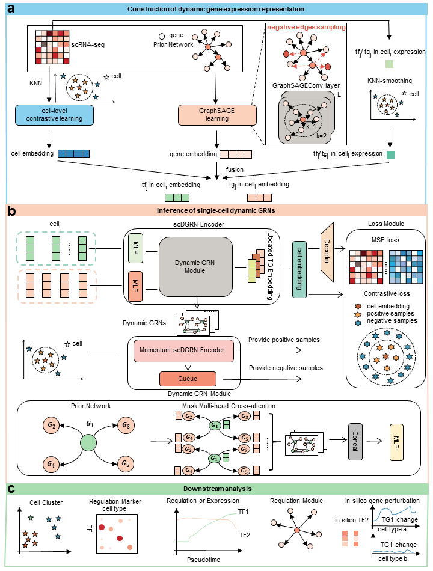

# scDGRN

scDGRN is a deep-learning framework for inferring **single-cell dynamic gene regulatory networks (GRNs)** from single-cell RNA sequencing (scRNA-seq) data. Given an expression matrix, transcription factor (TF) annotations and a background regulatory network, scDGRN estimates cell-context-specific TF-target regulatory strengths and supports downstream analyses of regulatory specificity, GRN significance, TF perturbation and pathway-level regulatory activity.



## Method Overview

scDGRN contains three major components.

1. **Cell-token pretraining** learns cell-state representations from scRNA-seq profiles. A MoCo-style contrastive learning model treats K-nearest-neighbor cells as positive samples and maintains a momentum encoder with a negative queue. The resulting cell tokens encode local cell-state context and are reused during dynamic GRN inference.

2. **Gene-token pretraining and background-network construction** learns gene representations with a GraphSAGE link-prediction model. For benchmark datasets, the background network is initialized from the gold-standard network and expanded with candidate edges selected by the absolute Pearson correlation coefficient computed from the RNA-seq matrix. For real scRNA-seq datasets, species-specific prior resources are used to build TF-target candidate networks.

3. **Single-cell dynamic GRN inference** combines pretrained cell tokens, pretrained gene tokens and cell-specific expression values. A masked multi-head cross-attention module constrains candidate TF-target interactions by the background network and estimates regulatory strengths for each cell. The model is optimized with an expression reconstruction loss and a cell-level contrastive loss, and outputs both per-cell GRNs and a dataset-level averaged GRN.

The main output of scDGRN is a dynamic GRN tensor represented as per-cell TF-target regulatory matrices. Downstream analyses summarize these matrices into TF specificity, GRN significance, cell-type-specific regulators, pathway scores and in silico TF-knockout effects.

## Installation

A CUDA-enabled GPU is recommended for real scRNA-seq datasets. The code falls back to CPU if CUDA is not available, but large datasets are expected to run slowly on CPU.

```bash
conda create -n scdgrn python=3.10 -y
conda activate scdgrn
pip install -r requirements.txt
```

Install `torch` and `torch-geometric` with wheels compatible with your CUDA version if the generic installation fails.

Main dependencies are listed in `requirements.txt` and include `torch`, `torch-geometric`, `scanpy`, `anndata`, `hnswlib`, `pyarrow`, `numpy`, `pandas`, `scipy`, `scikit-learn`, `matplotlib`, `seaborn`, `umap-learn`, `igraph`, `leidenalg` and `statsmodels`.

## Repository Structure

```text
scDGRN/
├── main.py                              # Dynamic GRN inference entry point
├── scDGRN.py                            # scDGRN training and output logic
├── cell_token_pre_train.py              # Cell-token contrastive pretraining
├── gene_token_pre_train.py              # Gene-token GraphSAGE pretraining
├── gene_token_pre_train_nichenet_union.py
├── models/                              # Neural-network modules
├── utils/                               # Evaluation and downstream utilities
├── datasets/                            # Benchmark and real scRNA-seq datasets
├── pre_train_results/                   # Pretrained tokens and background networks
├── results/                             # Inference and tutorial outputs
├── tutorial/                            # Downstream analysis notebooks
├── tests/                               # Regression tests
├── requirements.txt
├── over_flows.pdf
└── over_flows.png
```

## Input Data

Each dataset is stored under `datasets/<data_name>/` or `datasets/<data_name>/<dataset_name>/`.

### Required Files

- `ExpressionData.csv`: expression matrix readable by `scanpy.read`.
  - Use `--cell_gene` when rows are cells and columns are genes.
  - Omit `--cell_gene` when rows are genes and columns are cells.
- `TF.csv`: one TF name per line. Required when `--has_tf_list` is used.

### Optional Files

- `cell_data.csv`: one cell label per row. Used by `--cell_labels` in `main.py` and `--has_cell_labels` in `cell_token_pre_train.py`.
- `pseudotime.csv`: pseudotime values for downstream trajectory-related analyses.
- `refNetwork.csv`: gold-standard network for benchmark evaluation. `main.py --true_network` uses `Gene1` and `Gene2`; `gene_token_pre_train.py` expects `Gene1`, `Gene2` and `Type`, where `Type` is `+` or `-`.

### Shared Prior Resources

- `datasets/Homo_sapiens_TF.txt`
- `datasets/Mus_musculus_TF.txt`
- `datasets/network_human.zip`
- `datasets/network_mouse.zip`

## Reproducibility Settings from the Manuscript

The following settings summarize the manuscript experiments and the original pre-cleanup workspace. They are included here to keep terminology and parameter naming consistent with the paper. The commands below use only the options supported by the cleaned `main.py` entry point.

| Dataset | Species | Expression matrix | TFs | Background network | Gold-standard network | Main settings |
|---|---:|---:|---:|---:|---:|---|
| `HSC` | mouse | 11 genes × 2,000 cells | all genes | 56 edges | 26 edges | `dropout_prob=0.01`, `learning_rate=1e-3`, `num_epochs=50`, `num_batchs=20`, `cl_k=6`, `k=10`, `gene_emb_dim=8`, `cell_emb_dim=8`, `emb_dim=4` |
| `GSD` | human | 19 genes × 2,000 cells | all genes | 176 edges | 76 edges | `dropout_prob=0.01`, `learning_rate=1e-3`, `num_epochs=50`, `num_batchs=20`, `cl_k=6`, `k=10`, `gene_emb_dim=8`, `cell_emb_dim=8`, `emb_dim=4` |
| `mDC` | mouse | 383 cells × 1,071 genes | 588 TFs | 111,633 prior edges | 10,050 edges | `gene_emb_dim=64`, `cell_emb_dim=64`, `emb_dim=16` |
| `hHep` | human | 425 cells × 1,152 genes | 709 TFs | 122,363 prior edges | 16,220 edges | `gene_emb_dim=64`, `cell_emb_dim=64`, `emb_dim=16` |
| `muraro` | human | 2,122 cells × 2,230 genes | dataset TF list | 101,440 prior edges | not used | `dropout_prob=0.3`, `learning_rate=1e-3`, `num_epochs=30`, `num_batchs=60`, `cl_k=16`, `k=25`, `edge_rate=0.5`, `gene_emb_dim=64`, `cell_emb_dim=64`, `emb_dim=32` |
| `pancreas` | mouse | 2,780 cells × 1,273 genes | 360 TFs | 54,799 prior edges | not used | `dropout_prob=0.3`, `learning_rate=1e-3`, `num_epochs=30`, `num_batchs=60`, `cl_k=10`, `k=25`, `edge_rate=0.5`, `gene_emb_dim=64`, `cell_emb_dim=64`, `emb_dim=32` |
| `forebrain` | human | dataset expression matrix | dataset TF list | 79,700 prior edges | not used | `dropout_prob=0.3`, `learning_rate=1e-3`, `num_epochs=30`, `num_batchs=100`, `cl_k=16`, `k=25`, `edge_rate=0.5`, `gene_emb_dim=64`, `cell_emb_dim=64`, `emb_dim=32` |

For the `HSC` and `GSD` benchmarks, the background network was constructed by starting from the gold-standard network and adding top-ranked candidate edges according to the absolute Pearson correlation coefficient computed from the RNA-seq matrix. In the manuscript notes, `HSC` used 26 gold-standard edges plus the top 30 Pearson-correlation edges, and `GSD` used 76 gold-standard edges plus the top 100 Pearson-correlation edges.

## Running scDGRN

The complete workflow has three stages.

### 1. Cell-token Pretraining

```bash
python cell_token_pre_train.py \
    --dataset_name pancreas \
    --cell_by_gene \
    --has_cell_labels \
    --cell_emb_dim 64 \
    --num_epochs 50 \
    --num_batchs 20 \
    --k 16 \
    --learning_rate 0.01 \
    --noise_factor 0.001 \
    --mask_rate 0.001 \
    --gpu 0
```

Outputs are saved to `pre_train_results/<dataset_name>/`:

- `cell_embedding.csv`: pretrained cell-token embeddings.
- `cell_trajectory.png`: UMAP visualization of cell-token embeddings.

For benchmark datasets stored as gene-by-cell matrices, omit `--cell_by_gene`:

```bash
python cell_token_pre_train.py \
    --dataset_name GSD/GSD-2000-1 \
    --cell_emb_dim 8 \
    --num_epochs 50 \
    --num_batchs 20 \
    --k 6 \
    --learning_rate 0.01 \
    --noise_factor 0.001 \
    --mask_rate 0.001 \
    --gpu 0
```

### 2. Gene-token Pretraining and Background-network Refinement

```bash
python gene_token_pre_train.py \
    --dataset_name pancreas \
    --cell_by_gene \
    --has_tf_list \
    --gene_emb_dim 64 \
    --hidden_emb_dim 256 \
    --num_epochs 100 \
    --learning_rate 0.001 \
    --correlation_top_k 30 \
    --gpu 0
```

Outputs are saved to `pre_train_results/<dataset_name>/`:

- `gene_embedding.csv`: pretrained gene-token embeddings.
- `tf_prior_network.csv`: refined TF-target background network.

For `GSD`, use `--gene_emb_dim 8` and set `--correlation_top_k 100` to match the manuscript setting. For `HSC`, use `--gene_emb_dim 8` and `--correlation_top_k 30`.

If `pre_train_results/<dataset_name>/tf_prior_network.npz` or `tf_prior_network.csv` already exists, `main.py` can use the pretrained background network directly.

### 3. Dynamic GRN Inference

#### Muraro

```bash
python main.py \
    --has_tf_list \
    --draw_cell_tra \
    --cell_labels \
    --cell_gene \
    --data_name muraro \
    --dropout_prob 0.3 \
    --learning_rate 1e-3 \
    --num_epochs 30 \
    --num_batchs 60 \
    --cl_k 16 \
    --k 25 \
    --edge_rate 0.5 \
    --save_dir ./results/muraro/ \
    --save_single_network_tf_dir ./results/muraro/single_network_tf/ \
    --save_single_network_dir ./results/muraro/single_network/ \
    --save_cell_embedding_dir ./results/muraro/cell_embedding/ \
    --gene_emb_dim 64 \
    --cell_emb_dim 64 \
    --emb_dim 32 \
    --gpu 0
```

#### Pancreas

```bash
python main.py \
    --has_tf_list \
    --draw_cell_tra \
    --cell_labels \
    --cell_gene \
    --data_name pancreas \
    --dropout_prob 0.3 \
    --learning_rate 1e-3 \
    --num_epochs 30 \
    --num_batchs 60 \
    --cl_k 10 \
    --k 25 \
    --edge_rate 0.5 \
    --save_dir ./results/pancreas/ \
    --save_single_network_tf_dir ./results/pancreas/single_network_tf/ \
    --save_single_network_dir ./results/pancreas/single_network/ \
    --save_cell_embedding_dir ./results/pancreas/cell_embedding/ \
    --gene_emb_dim 64 \
    --cell_emb_dim 64 \
    --emb_dim 32 \
    --gpu 0
```

#### Forebrain

```bash
python main.py \
    --has_tf_list \
    --draw_cell_tra \
    --cell_labels \
    --cell_gene \
    --data_name forebrain \
    --dropout_prob 0.3 \
    --learning_rate 1e-3 \
    --num_epochs 30 \
    --num_batchs 100 \
    --cl_k 16 \
    --k 25 \
    --edge_rate 0.5 \
    --save_dir ./results/forebrain/ \
    --save_single_network_tf_dir ./results/forebrain/single_network_tf/ \
    --save_single_network_dir ./results/forebrain/single_network/ \
    --save_cell_embedding_dir ./results/forebrain/cell_embedding/ \
    --gene_emb_dim 64 \
    --cell_emb_dim 64 \
    --emb_dim 32 \
    --gpu 0
```

#### GSD and HSC Benchmarks

```bash
python main.py \
    --true_network \
    --data_name GSD/GSD-2000-1 \
    --dropout_prob 0.01 \
    --mask_rate 0.01 \
    --learning_rate 1e-3 \
    --num_epochs 50 \
    --num_batchs 20 \
    --cl_k 6 \
    --k 10 \
    --save_dir ./results/GSD/GSD-2000-1/ \
    --gene_emb_dim 8 \
    --cell_emb_dim 8 \
    --emb_dim 4 \
    --gpu 0
```

Replace `GSD/GSD-2000-1` with an `HSC/<dataset_name>` directory for the HSC benchmark.

## TF-knockout Analysis

The dynamic GRN inference stage supports in silico TF knockout through `--knockout_tf`. For example, to evaluate Pdx1 perturbation in pancreas:

```bash
python main.py \
    --has_tf_list \
    --draw_cell_tra \
    --cell_labels \
    --cell_gene \
    --data_name pancreas \
    --dropout_prob 0.3 \
    --learning_rate 1e-3 \
    --num_epochs 30 \
    --num_batchs 60 \
    --cl_k 10 \
    --k 25 \
    --edge_rate 0.5 \
    --save_dir ./results/pancreas_knock_pdx1/ \
    --save_single_network_tf_dir ./results/pancreas_knock_pdx1/single_network_tf/ \
    --save_single_network_dir ./results/pancreas_knock_pdx1/single_network/ \
    --save_cell_embedding_dir ./results/pancreas_knock_pdx1/cell_embedding/ \
    --gene_emb_dim 64 \
    --cell_emb_dim 64 \
    --emb_dim 32 \
    --knockout_tf Pdx1 \
    --gpu 0
```

Run the same command without `--knockout_tf` and save it to a separate output directory, such as `results/pancreas_wild/`, to obtain the wild-type reference.

## Output Files

By default, outputs are saved under `results/<dataset_name>/` unless custom output directories are provided.

- `<dataset_name>_GRN.npz`: dataset-level averaged GRN.
- `reconstructed_expression.h5ad`: reconstructed expression matrix.
- `single_network/cell<i>.npz`: per-cell TF-target regulatory matrix.
- `single_network_tf/cell<i>.parquet`: per-cell top TF-target edges with columns `TF Gene`, `TG Gene` and `Edge Weight`.
- `cell_embedding/cell_embedding.csv`: cell embeddings generated during dynamic GRN inference when `--draw_cell_tra` is enabled.
- `cell_embedding/cell_trajectory.png`: UMAP or PCA visualization of inferred cell embeddings when `--draw_cell_tra` is enabled.
- `results/evaluation_metric.csv`: AUROC and AUPRC values when `--true_network` is enabled.

## Command-line Options

### Dynamic GRN Inference

```bash
python main.py [-h] \
    [--seed SEED] [--data_name DATA_NAME] [--has_tf_list] [--cell_labels] \
    [--true_network] [--cell_gene] [--gpu GPU] \
    [--datasets-dir PATH] [--pretrain-dir PATH] [--results-dir PATH] \
    [--draw_cell_tra] [--pca] \
    [--save_dir PATH] [--save_single_network_tf_dir PATH] \
    [--save_single_network_dir PATH] [--save_cell_embedding_dir PATH] \
    [--num_epochs NUM_EPOCHS] [--num_batchs NUM_BATCHS] \
    [--learning_rate LEARNING_RATE] [--dropout_prob DROPOUT_PROB] \
    [--gene_emb_dim GENE_EMB_DIM] [--cell_emb_dim CELL_EMB_DIM] \
    [--emb_dim EMB_DIM] [--cl_k CL_K] [--k K] \
    [--knockout_tf KNOCKOUT_TF] [--edge_rate EDGE_RATE]
```

### Cell-token Pretraining

```bash
python cell_token_pre_train.py [-h] \
    [--dataset_name DATASET_NAME] [--cell_by_gene] [--has_cell_labels] \
    [--datasets-dir PATH] [--pretrain-dir PATH] \
    [--cell_emb_dim CELL_EMB_DIM] [--seed SEED] [--gpu GPU] \
    [--k K] [--num_batchs NUM_BATCHS] [--num_epochs NUM_EPOCHS] \
    [--learning_rate LEARNING_RATE] [--noise_factor NOISE_FACTOR] \
    [--mask_rate MASK_RATE]
```

### Gene-token Pretraining

```bash
python gene_token_pre_train.py [-h] \
    [--dataset_name DATASET_NAME] [--cell_by_gene] [--has_tf_list] \
    [--datasets-dir PATH] [--pretrain-dir PATH] \
    [--gene_emb_dim GENE_EMB_DIM] [--hidden_emb_dim HIDDEN_EMB_DIM] \
    [--dropout_prob DROPOUT_PROB] [--seed SEED] [--gpu GPU] \
    [--num_epochs NUM_EPOCHS] [--learning_rate LEARNING_RATE] \
    [--correlation_top_k CORRELATION_TOP_K] \
    [--delete_edge_percentile DELETE_EDGE_PERCENTILE] \
    [--add_edge_percentile ADD_EDGE_PERCENTILE]
```

## Downstream Analysis Notebooks

The [`tutorial/`](tutorial/README.md) directory contains curated, dataset-specific downstream analyses. These workflows use the per-cell GRNs generated by `main.py` and cover GRN-based cell clustering, cell-type similarity, TF regulatory activity, developmental pseudotime and focused biological case studies.

```bash
jupyter lab tutorial/forebrain_tutorial/workflow.ipynb
jupyter lab tutorial/pancreas_tutorial/workflow.ipynb
jupyter lab tutorial/muraro_tutorial/workflow.ipynb
```

Each notebook expects:

- `results/<result_name>/single_network_tf/cell*.parquet`
- `results/<result_name>/single_network/cell*.npz`

Focused analyses are also provided for forebrain TF-GRN importance, Muraro candidate cell reannotation and pancreatic Pdx1-target activity along pseudotime. Large inferred-network files remain under `results/` and are not committed to Git. Tutorial-derived matrices and figures are written to `results/<result_name>/tutorial_outputs/`.

When results are stored under a non-default name or outside the repository, configure them before launching Jupyter:

```bash
export SCDGRN_RESULTS_ROOT=/path/to/results
export SCDGRN_RESULT_NAME=forebrain_430
```

## Testing

The cleaned repository includes a synthetic-output parity test against the original research implementation. The test constructs a small `parity_tiny` dataset, runs both implementations with the same pretrained tokens and hyperparameters, and compares the dataset-level GRN, all per-cell GRNs and all per-cell TF-target edge tables.

```bash
python -m unittest tests.test_output_parity -v
```

This parity check has been run successfully on the cleaned repository. The maximum absolute difference between the cleaned and original dataset-level GRNs was `0.0`, all six per-cell GRN matrices matched at `atol=1e-12`, and all six per-cell edge tables were identical. A Python environment with the runtime dependencies in `requirements.txt` is required.

## Notes for New Datasets

- Keep gene names consistent across `ExpressionData.csv`, `TF.csv`, `refNetwork.csv`, `gene_embedding.csv` and `tf_prior_network.csv`.
- Before running `main.py`, make sure `pre_train_results/<dataset_name>/cell_embedding.csv`, `gene_embedding.csv` and either `tf_prior_network.npz` or `tf_prior_network.csv` are available.
- Use `--cell_gene` only when the expression matrix is cell-by-gene.
- Use `--true_network` only when `refNetwork.csv` is available for benchmark evaluation.
- Adjust `--num_batchs`, `--k`, `--cl_k` and `--edge_rate` according to dataset size and GPU memory.
